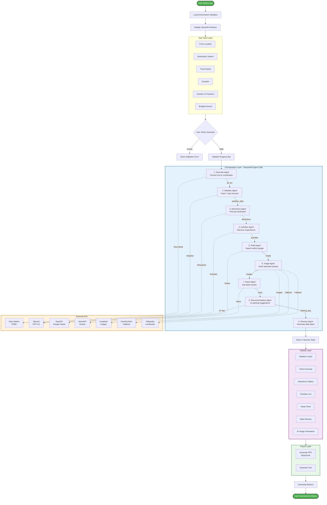
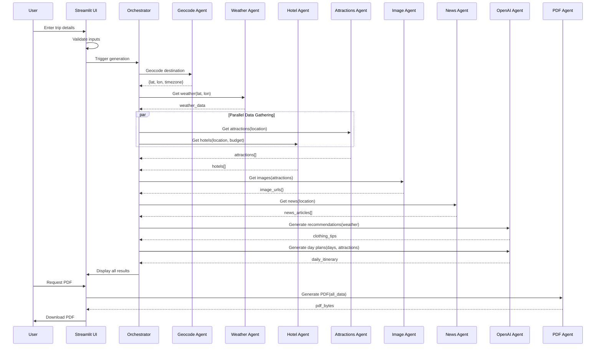

# 🌍 Building an AI-Powered Travel Itinerary Agent
## A Complete Step-by-Step Guide for Students

**Author:** Ashu Mishra  
**Last Updated:** December 2024  
**Difficulty Level:** Intermediate  
**Estimated Time:** 8-12 hours  

---

## 📜 Copyright & Usage Notice

```
© 2025 Ashu Mishra. All Rights Reserved.

This project is the sole intellectual property of Ashu Mishra 
and is shared exclusively for educational and academic purposes.

PERMITTED USES:
✅ Learning and studying the codebase
✅ Building similar projects for personal education
✅ Using as reference material in academic settings
✅ Classroom demonstrations and teaching

PROHIBITED USES:
❌ Commercial use or monetization
❌ Redistribution without attribution
❌ Claiming as original work
❌ Selling or licensing to third parties

For any other use cases, please contact:
LinkedIn: https://www.linkedin.com/in/ashumish/
```

---

## 📚 Table of Contents

1. [The Problem We're Solving](#1-the-problem-were-solving)
2. [Solution Overview](#2-solution-overview)
3. [What You'll Learn](#3-what-youll-learn)
4. [Application Architecture](#4-application-architecture)
5. [API Ecosystem Deep Dive](#5-api-ecosystem-deep-dive)
6. [Building the Application: Task-Based Approach](#6-building-the-application-task-based-approach)
7. [Future Enhancements](#7-future-enhancements)
8. [Deployment Guide](#8-deployment-guide)
9. [Troubleshooting](#9-troubleshooting)
10. [Resources & References](#10-resources--references)

---

## 1. The Problem We're Solving

### 📖 Meet Rahul's Challenge

**Rahul** is a budding solo entrepreneur and AI enthusiast who loves to travel. Like many of us, he faces a frustrating problem every time he plans a holiday:

#### The Traditional Travel Planning Nightmare:

1. **Multiple Websites, Multiple Tabs:**
   - Google for general information about the destination
   - TripAdvisor for attractions and reviews
   - Booking.com for hotels
   - Weather.com for forecasts
   - Local news sites for events and festivals
   - Pinterest for packing inspiration
   - Excel for budget tracking

2. **Time-Consuming Process:**
   - Spending 8-15 hours researching for a 3-day trip
   - Copy-pasting information into documents
   - Cross-referencing prices and dates
   - Manually creating itineraries in Word/Google Docs

3. **Information Overload:**
   - Too many options, unclear which to trust
   - Outdated recommendations
   - Missing latest events or festivals
   - No personalized suggestions based on weather

4. **Sharing Difficulties:**
   - Creating PDF manually
   - Formatting issues
   - No visual appeal
   - Missing important details

#### The Cost of Inefficiency:

- **Time:** 10+ hours per trip planning
- **Stress:** Decision fatigue from too many options
- **Missed Opportunities:** Events happening during the trip
- **Over Budget:** No clear budget tracking for hotels

### 💡 Rahul's Vision: The One-Stop Solution

Rahul imagined an AI-powered application that could:

✅ **Aggregate all information in one place**  
✅ **Provide personalized recommendations** based on weather, budget, and preferences  
✅ **Find hotels strictly within budget** (no surprises!)  
✅ **Show latest news and events** happening at the destination  
✅ **Generate beautiful, shareable PDF itineraries**  
✅ **Include AI-generated visuals** for each day  
✅ **Save 90% of planning time** (from 10 hours to 1 hour)

### 🎯 The Solution: AI Travel Itinerary Agent

This is where **AI Agents** come into the picture. Instead of a single AI doing everything, Rahul built a system where multiple specialized AI agents work together:

- 🌤️ **Weather Agent**: Fetches forecast and suggests packing
- 🏨 **Hotel Agent**: Finds best hotels within strict budget
- 🎭 **Attractions Agent**: Discovers must-see places
- 📰 **News Agent**: Pulls latest events and happenings
- 🎨 **Visual Agent**: Generates custom images for each day
- 📄 **Document Agent**: Creates professional PDF itineraries

Together, these agents create a seamless experience where users input their trip details and get a complete, personalized itinerary in minutes!

---

## 2. Solution Overview

### 🤖 What is an AI Agent?

An **AI Agent** is a software program that:
- Has a specific task or goal
- Can make decisions autonomously
- Uses AI/ML models to process information
- Interacts with APIs and data sources
- Collaborates with other agents

**Think of it like a team of specialists:**
- Instead of one person doing everything, you have experts for each task
- Each expert (agent) is really good at their specific job
- They work together seamlessly to achieve a common goal

### 🏗️ High-Level Architecture

```
┌─────────────┐
│   USER      │
│  (Inputs)   │
└──────┬──────┘
       │
       ▼
┌─────────────────────────────────────┐
│    STREAMLIT WEB INTERFACE          │
│  (User Input + Results Display)     │
└──────┬──────────────────────────────┘
       │
       ▼
┌─────────────────────────────────────┐
│   ORCHESTRATION LAYER               │
│   (Coordinates all agents)          │
└──────┬──────────────────────────────┘
       │
       ├──────────┬──────────┬─────────┬──────────┬──────────┐
       ▼          ▼          ▼         ▼          ▼          ▼
    ┌────┐    ┌────┐    ┌────┐    ┌────┐    ┌────┐    ┌────┐
    │🌤️ │    │🏨 │    │🎭 │    │📰 │    │🎨 │    │📄 │
    │WTH │    │HTL │    │ATR │    │NWS │    │IMG │    │PDF │
    └─┬──┘    └─┬──┘    └─┬──┘    └─┬──┘    └─┬──┘    └─┬──┘
      │         │         │         │         │         │
      ▼         ▼         ▼         ▼         ▼         ▼
    API 1     API 2     API 3     API 4     API 5    Library
```

### 🛠️ Technology Stack

| Layer | Technology | Purpose |
|-------|-----------|---------|
| **Frontend** | Streamlit | Web interface & user interaction |
| **Backend Logic** | Python 3.9+ | Core application logic |
| **AI/ML** | OpenAI GPT-3.5, DALL-E 3 | Natural language & image generation |
| **Weather Data** | Open-Meteo API | Real-time weather forecasts |
| **Hotel Search** | SerpAPI (Google Hotels) | Hotel recommendations |
| **News** | NewsAPI | Latest events & happenings |
| **Images** | Unsplash, DuckDuckGo, Wikipedia | Attraction visuals |
| **PDF Generation** | ReportLab | Professional document creation |
| **Deployment** | Streamlit Cloud | Free hosting |

### 🎯 Key Features

1. **Smart Location Search**: Type any city, get intelligent matching
2. **Budget-Aware Hotels**: 50-75% of daily budget allocation
3. **Weather-Based Recommendations**: Pack appropriately for the climate
4. **AI-Generated Day Plans**: Personalized schedules for each day
5. **Latest News Integration**: Don't miss festivals or events
6. **Custom Daily Visuals**: DALL-E 3 generated images for your trip
7. **Beautiful PDF Export**: Share with friends and family
8. **Multi-Currency Support**: ₹ (INR) and $ (USD)

---

## 3. What You'll Learn

By building this project, you'll master:

### 🎓 Core Concepts

1. **AI Agent Orchestration**
   - How to design multi-agent systems
   - Agent communication patterns
   - Async processing and coordination

2. **API Integration Mastery**
   - RESTful API consumption
   - Authentication (API keys, OAuth)
   - Rate limiting and error handling
   - Fallback strategies

3. **Prompt Engineering**
   - Crafting effective prompts for AI coding tools
   - Using Lovable, Claude Code, or Antigravity
   - Iterative refinement techniques

4. **State Management**
   - Session state in Streamlit
   - Caching strategies
   - Data persistence

5. **Production Deployment**
   - Environment variable management
   - Secret handling
   - Cloud deployment (Streamlit Cloud)

### 💼 Real-World Skills

- **Problem Decomposition**: Breaking complex problems into tasks
- **API Economics**: Understanding free tiers, pricing, and optimization
- **User Experience Design**: Creating intuitive interfaces
- **Error Handling**: Graceful degradation and fallbacks
- **Documentation**: Writing clear, maintainable code

---

## 4. Application Architecture

### 📊 Detailed Architecture Diagram



### 🔄 Data Flow Sequence



### 🧩 Component Breakdown

#### 1. **Streamlit UI Layer**
- **File**: `app.py` (lines 1-100)
- **Responsibilities**:
  - Page configuration
  - Custom CSS styling
  - Form inputs
  - Progress indicators
  - Results display

#### 2. **Agent Functions**
- **Geocoding**: `geocode_location()` - Converts city names to coordinates
- **Weather**: `get_weather()` - Fetches forecast data
- **Hotels**: `get_hotels()` - Searches with budget filtering
- **Attractions**: `get_attractions()` - Uses OpenAI for curated list
- **Activities**: `get_activities()` - Suggests experiences
- **Images**: `get_images()` - Multi-source image fetching
- **News**: `get_latest_news()` - Event discovery
- **AI Recommendations**: `get_clothing_recommendation()` - Smart packing tips
- **Itinerary**: `generate_day_plan()` - Daily schedule creation

#### 3. **PDF Generation**
- **Function**: `download_pdf_button()`
- **Library**: ReportLab
- **Features**:
  - Multi-page layout
  - Embedded images
  - Styled tables
  - Custom fonts and colors

#### 4. **Session State Management**
```python
st.session_state.itinerary_data = {
    'from_place': str,
    'to_place': str,
    'num_days': int,
    'num_people': int,
    'budget': int,
    'attractions': list,
    'hotels': list,
    'weather': dict,
    'images': dict,
    'news': list,
    'daily_plans_list': list,
    'daily_images': dict  # AI-generated images
}
```

---

## 5. API Ecosystem Deep Dive

### 🌐 Complete API Reference

---

### API 1: Open-Meteo Weather API

#### 📋 Overview
- **Purpose**: Real-time weather forecasting and geocoding
- **Cost**: 100% FREE (No API key required!)
- **Rate Limit**: 10,000 requests/day
- **Documentation**: https://open-meteo.com/en/docs

#### 🎯 Why We Need It
Weather is critical for:
- Packing recommendations (what clothes to bring)
- Activity planning (avoid outdoor activities in rain)
- Safety warnings (extreme temperatures, storms)
- User experience (set realistic expectations)

#### 🔑 How to Get Access
**No API key needed!** Just use the public endpoint.

#### 📝 Sample Request (Geocoding)

```bash
# Using curl
curl "https://geocoding-api.open-meteo.com/v1/search?name=Paris&count=5&language=en&format=json"

# Using Python
import requests

response = requests.get(
    "https://geocoding-api.open-meteo.com/v1/search",
    params={
        "name": "Paris",
        "count": 5,
        "language": "en",
        "format": "json"
    }
)
print(response.json())
```

#### 📤 Sample Response (Geocoding)

```json
{
  "results": [
    {
      "id": 2988507,
      "name": "Paris",
      "latitude": 48.85341,
      "longitude": 2.3488,
      "elevation": 42.0,
      "timezone": "Europe/Paris",
      "country": "France",
      "country_code": "FR",
      "admin1": "Île-de-France"
    }
  ]
}
```

#### 📝 Sample Request (Weather Forecast)

```bash
# Using curl
curl "https://api.open-meteo.com/v1/forecast?latitude=48.8534&longitude=2.3488&current=temperature_2m,weather_code,wind_speed_10m,relative_humidity_2m&daily=weather_code,temperature_2m_max,temperature_2m_min&timezone=Europe/Paris"

# Using Python
import requests

response = requests.get(
    "https://api.open-meteo.com/v1/forecast",
    params={
        "latitude": 48.8534,
        "longitude": 2.3488,
        "current": "temperature_2m,weather_code,wind_speed_10m,relative_humidity_2m",
        "daily": "weather_code,temperature_2m_max,temperature_2m_min",
        "timezone": "Europe/Paris",
        "forecast_days": 7
    }
)
print(response.json())
```

#### 📤 Sample Response (Weather)

```json
{
  "latitude": 48.85,
  "longitude": 2.35,
  "timezone": "Europe/Paris",
  "current": {
    "time": "2024-12-26T15:00",
    "temperature_2m": 12.5,
    "weather_code": 2,
    "wind_speed_10m": 15.2,
    "relative_humidity_2m": 72
  },
  "daily": {
    "time": ["2024-12-26", "2024-12-27", "2024-12-28"],
    "weather_code": [2, 3, 61],
    "temperature_2m_max": [15.2, 14.8, 12.1],
    "temperature_2m_min": [8.3, 9.1, 7.5]
  }
}
```

#### 💡 Implementation Tips
- Always include timezone for accurate times
- Weather codes: 0=clear, 1-3=cloudy, 61-65=rain, 71-77=snow
- Cache results for same location (valid for 1 hour)
- Fallback to simplified forecast if API fails

---

### API 2: OpenAI API (GPT-3.5 & DALL-E 3)

#### 📋 Overview
- **Purpose**: Natural language generation and image creation
- **Cost**: Pay-as-you-go (GPT-3.5: ~$0.002/1K tokens, DALL-E 3: $0.040/image)
- **Rate Limit**: Tier-based (new accounts: 3 RPM)
- **Documentation**: https://platform.openai.com/docs

#### 🎯 Why We Need It
- **GPT-3.5**: Curated attraction lists, personalized recommendations, packing tips
- **DALL-E 3**: Custom daily images showing specific trip moments

#### 🔑 How to Get API Key

**Step-by-Step:**

1. Visit https://platform.openai.com/signup
2. Create account (email + phone verification)
3. Go to https://platform.openai.com/api-keys
4. Click "Create new secret key"
5. **Copy immediately** (won't show again!)
6. Add to `.env` file:
   ```
   OPENAI_API_KEY=sk-proj-xxxxxxxxxxxxxxxx
   ```

#### 📝 Sample Request (GPT-3.5 - Attractions)

```python
from openai import OpenAI
import os

client = OpenAI(api_key=os.getenv("OPENAI_API_KEY"))

response = client.chat.completions.create(
    model="gpt-3.5-turbo",
    messages=[{
        "role": "user",
        "content": """List top 5 tourist attractions in Paris.
        Return a JSON array with: name, type, lat, lon, summary (max 200 chars).
        Do not include markdown formatting."""
    }],
    temperature=0.7
)

print(response.choices[0].message.content)
```

#### 📤 Sample Response (GPT-3.5)

```json
[
  {
    "name": "Eiffel Tower",
    "type": "Landmark",
    "lat": 48.8584,
    "lon": 2.2945,
    "summary": "Iconic iron tower offering panoramic city views from observation decks. Symbol of Paris and must-visit monument."
  },
  {
    "name": "Louvre Museum",
    "type": "Museum",
    "lat": 48.8606,
    "lon": 2.3376,
    "summary": "World's largest art museum housing Mona Lisa, Venus de Milo, and 35,000 works across 652,000 sq ft."
  }
]
```

#### 📝 Sample Request (DALL-E 3 - Image Generation)

```python
from openai import OpenAI

client = OpenAI(api_key=os.getenv("OPENAI_API_KEY"))

response = client.images.generate(
    model="dall-e-3",
    prompt="A hyper-realistic travel photography shot of Paris at sunset. The scene features the Eiffel Tower with tourists nearby. Sunny lighting, vibrant colors, cinematic composition, 4k resolution.",
    size="1024x1024",
    quality="standard",
    n=1
)

image_url = response.data[0].url
print(image_url)
```

#### 📤 Sample Response (DALL-E 3)

```json
{
  "created": 1703606400,
  "data": [
    {
      "url": "https://oaidalleapiprodscus.blob.core.windows.net/private/...",
      "revised_prompt": "A hyper-realistic travel photograph capturing Paris during sunset..."
    }
  ]
}
```

#### 💡 Implementation Tips
- Use `gpt-3.5-turbo` for text (10x cheaper than GPT-4)
- For DALL-E, keep prompts under 1000 chars
- Add temperature=0.7 for creative variety
- Cache GPT responses for same queries
- Handle JSON parsing errors gracefully

#### 💰 Cost Optimization
- **Expected cost per itinerary**: $0.20-0.50
  - GPT-3.5 (attractions, activities, tips): ~$0.01
  - DALL-E 3 (3 images): ~$0.12
  - Total: ~$0.13 per user

---

### API 3: SerpAPI (Google Hotels Search)

#### 📋 Overview
- **Purpose**: Real-time hotel search with prices, ratings, reviews
- **Cost**: Free tier (100 searches/month), then $50/month
- **Rate Limit**: 1 request/second (free tier)
- **Documentation**: https://serpapi.com/google-hotels-api

#### 🎯 Why We Need It
- Real hotel prices (not estimates)
- User reviews and ratings
- Direct booking links
- Budget filtering capabilities

#### 🔑 How to Get API Key

**Step-by-Step:**

1. Visit https://serpapi.com/users/sign_up
2. Sign up with email
3. Verify email address
4. Go to Dashboard → API Key
5. Copy your API key
6. Add to `.env`:
   ```
   SERP_API_KEY=your_serpapi_key_here
   ```

#### 📝 Sample Request

```python
from serpapi import GoogleSearch
import os

params = {
    "engine": "google_hotels",
    "q": "hotels in Paris",
    "check_in_date": "2025-01-15",
    "check_out_date": "2025-01-18",
    "adults": 2,
    "currency": "USD",
    "gl": "us",
    "hl": "en",
    "api_key": os.getenv("SERP_API_KEY")
}

search = GoogleSearch(params)
results = search.get_dict()

for hotel in results.get("properties", [])[:5]:
    print(f"{hotel['name']}: ${hotel['rate_per_night']['lowest']}")
```

#### 📤 Sample Response

```json
{
  "search_metadata": {
    "status": "Success",
    "total_time_taken": 2.35
  },
  "properties": [
    {
      "name": "Hotel Le Marais",
      "description": "Boutique hotel in central Paris",
      "link": "https://www.google.com/travel/hotels/...",
      "images": [
        {"thumbnail": "https://..."}
      ],
      "overall_rating": 4.5,
      "reviews": 1247,
      "rate_per_night": {
        "lowest": "$185",
        "extracted_lowest": 185
      },
      "amenities": ["Free WiFi", "Breakfast included", "Air conditioning"]
    }
  ]
}
```

#### 💡 Implementation Tips
- Always filter by budget AFTER fetching results
- Set check-in date 7 days in future for consistent results
- Use `gl` parameter for country-specific results
- Cache results for same city (24-hour validity)
- Implement retry logic for rate limits

---

### API 4: NewsAPI

#### 📋 Overview
- **Purpose**: Latest news articles and events
- **Cost**: Free tier (100 requests/day), Developer: $449/month
- **Rate Limit**: 100 requests/day (free)
- **Documentation**: https://newsapi.org/docs

#### 🎯 Why We Need It
- Discover festivals and events happening during trip
- Local news and safety information
- Concert and exhibition schedules
- Cultural happenings

#### 🔑 How to Get API Key

**Step-by-Step:**

1. Visit https://newsapi.org/register
2. Fill out registration form
3. Verify email
4. Copy API key from dashboard
5. Add to `.env`:
   ```
   NEWS_API_KEY=your_newsapi_key_here
   ```

#### 📝 Sample Request

```python
import requests
import os

url = "https://newsapi.org/v2/everything"
params = {
    "q": '"Paris" AND (events OR festival OR concert OR exhibition)',
    "apiKey": os.getenv("NEWS_API_KEY"),
    "language": "en",
    "sortBy": "relevancy",
    "pageSize": 5
}

response = requests.get(url, params=params)
data = response.json()

for article in data.get("articles", []):
    print(f"{article['title']} - {article['source']['name']}")
```

#### 📤 Sample Response

```json
{
  "status": "ok",
  "totalResults": 234,
  "articles": [
    {
      "source": {"name": "Time Out Paris"},
      "author": "Emily Monaco",
      "title": "Best Christmas Markets in Paris 2024",
      "description": "Discover the most magical Christmas markets happening in Paris this December...",
      "url": "https://www.timeout.com/paris/...",
      "urlToImage": "https://...",
      "publishedAt": "2024-12-15T10:30:00Z",
      "content": "Paris transforms into a winter wonderland..."
    }
  ]
}
```

#### 💡 Implementation Tips
- Use specific queries: `"city" AND (events OR festival)`
- Sort by `relevancy` for best results
- Cache results (6-hour validity)
- Show metadata (source, publish date) to users
- Handle empty results gracefully

---

### API 5: Unsplash Images API

#### 📋 Overview
- **Purpose**: High-quality travel and landmark photos
- **Cost**: FREE (50 requests/hour)
- **Rate Limit**: 50/hour (demo), 5000/hour (production)
- **Documentation**: https://unsplash.com/documentation

#### 🎯 Why We Need It
- Professional-quality images
- Royalty-free usage
- Better UX than generic placeholders

#### 🔑 How to Get API Key

**Step-by-Step:**

1. Visit https://unsplash.com/developers
2. Click "Register as a Developer"
3. Create new application
   - Name: "AI Travel Planner"
   - Description: "Educational trip itinerary app"
4. Accept terms
5. Copy "Access Key"
6. Add to `.env`:
   ```
   UNSPLASH_API_KEY=your_access_key_here
   ```

#### 📝 Sample Request

```python
import requests
import os

url = "https://api.unsplash.com/search/photos"
params = {
    "query": "Eiffel Tower Paris",
    "per_page": 1,
    "client_id": os.getenv("UNSPLASH_API_KEY"),
    "order_by": "relevant",
    "orientation": "landscape"
}

response = requests.get(url, params=params)
data = response.json()

if data["results"]:
    image_url = data["results"][0]["urls"]["regular"]
    print(image_url)
```

#### 📤 Sample Response

```json
{
  "total": 1247,
  "total_pages": 125,
  "results": [
    {
      "id": "abc123",
      "urls": {
        "raw": "https://images.unsplash.com/photo-...",
        "full": "https://images.unsplash.com/photo-...?w=1920",
        "regular": "https://images.unsplash.com/photo-...?w=1080",
        "small": "https://images.unsplash.com/photo-...?w=400"
      },
      "user": {
        "name": "John Photographer",
        "username": "johnphoto"
      },
      "description": "Beautiful view of Eiffel Tower at sunset"
    }
  ]
}
```

#### 💡 Implementation Tips
- Use `regular` size (1080px) for good balance
- Always credit photographer (per Unsplash guidelines)
- Implement fallback to other sources
- Cache image URLs (don't re-fetch same query)

---

### API 6 & 7: DuckDuckGo Search & Wikipedia (Fallbacks)

#### 📋 Overview
- **Purpose**: Backup image sources when Unsplash fails
- **Cost**: 100% FREE
- **Rate Limit**: Reasonable use (no hard limits)
- **Documentation**: 
  - DuckDuckGo: https://github.com/deedy5/duckduckgo_search
  - Wikipedia: https://www.mediawiki.org/wiki/API:Main_page

#### 📝 Sample Request (DuckDuckGo)

```python
from duckduckgo_search import DDGS

with DDGS() as ddgs:
    results = list(ddgs.images(
        keywords="Eiffel Tower",
        region="wt-wt",
        safesearch="on",
        size="Large",
        max_results=1
    ))
    
    if results:
        image_url = results[0]["image"]
        print(image_url)
```

#### 📝 Sample Request (Wikipedia)

```python
import requests

url = "https://en.wikipedia.org/w/api.php"
params = {
    "action": "query",
    "generator": "search",
    "gsrsearch": "Eiffel Tower",
    "gsrlimit": 1,
    "prop": "pageimages",
    "pithumbsize": 1000,
    "format": "json"
}

response = requests.get(url, params=params)
data = response.json()

pages = data.get("query", {}).get("pages", {})
for page_id in pages:
    if "thumbnail" in pages[page_id]:
        image_url = pages[page_id]["thumbnail"]["source"]
        print(image_url)
```

#### 💡 Implementation Tips
- Use as fallbacks in this order: Unsplash → DuckDuckGo → Wikipedia → Placeholder
- Always have a final placeholder fallback
- Log which source was used for debugging

---

### 🔒 API Key Security Best Practices

1. **Never commit `.env` to git**
   ```bash
   # Add to .gitignore
   .env
   *.env
   ```

2. **Use environment variables**
   ```python
   import os
   from dotenv import load_dotenv
   
   load_dotenv()
   api_key = os.getenv("OPENAI_API_KEY")
   ```

3. **For deployment (Streamlit Cloud)**
   - Go to App Settings → Secrets
   - Add in TOML format:
     ```toml
     OPENAI_API_KEY = "sk-..."
     SERP_API_KEY = "..."
     NEWS_API_KEY = "..."
     UNSPLASH_API_KEY = "..."
     ```

---

## 6. Building the Application: Task-Based Approach

This section provides **15 progressive tasks** with **exact prompts** you can use in **Lovable.dev**, **Claude Code**, or **Antigravity** to build the application step-by-step.

### 📚 How to Use These Prompts

1. **Start a new project** in your AI coding tool
2. **Copy-paste each prompt** exactly as written
3. **Review the generated code** before moving to next task
4. **Test each feature** before proceeding
5. **Iterate if needed** by providing feedback to the AI

---

### 🎯 Task 1: Project Setup & Basic UI

**Objective**: Create the Streamlit project structure and basic interface

**Prompt for AI Coding Tool**:

```
Create a Streamlit application called "AI Travel Itinerary Agent" with the following specifications:

1. File structure:
   - app.py (main application)
   - .env.example (template for API keys)
   - .gitignore (include .env, __pycache__, *.pyc)
   - requirements.txt

2. In app.py, create:
   - Page config with title "🌍 Iteration Planner Agent", wide layout, expanded sidebar
   - Custom CSS for:
     * Header with gradient background (purple to blue)
     * Info boxes with left border accent
     * Weather cards with gradient background
   - Main header: "🌍 Iteration Planner Agent" with subtitle "Create Your Perfect Personalized Trip Itinerary"

3. In requirements.txt, add:
   - streamlit
   - requests
   - pandas
   - python-dotenv
   - openai
   - reportlab
   - google-search-results
   - duckduckgo-search
   - wikipedia

4. Create a sidebar showing:
   - "⚙️ Configuration" header
   - Info box explaining which APIs are configured/not configured

Run the app with `streamlit run app.py`
```

**Expected Output**: 
- Basic Streamlit app with styled header
- Proper file structure
- Dependencies listed

**Testing**: Run `streamlit run app.py` and verify the header displays correctly

---

### 🎯 Task 2: User Input Form

**Objective**: Create input fields for trip details

**Prompt for AI Coding Tool**:

```
Add user input functionality to the existing Streamlit app:

1. Create two columns in the main area

2. Left column ("📝 Trip Details"):
   - Text input: "From (Your Current Location)" with placeholder "e.g., New York, USA"
   - Text input: "Destination Search" with placeholder "e.g., Paris"
   - Info: Explain that after typing destination, user will see matching locations

3. Right column ("📋 Trip Info"):
   - Date input: "Travel Dates" (default: today, min: today)
   - Slider: "Duration (Days)" (1-30, default: 3)

4. Below, create two more columns:
   - Left: Number input "Number of Travelers" (1-20, default: 2)
   - Right: Number input "Total Budget (₹)" (1000-1000000, default: 25000, step: 500)

5. Add a large button at bottom: "🚀 Generate My Perfect Itinerary" (full width)

6. Add input validation:
   - Show error if "From" or "Destination" is empty when button clicked
   - Store values in variables for later use
```

**Expected Output**: Complete input form with validation

**Testing**: Enter test data and click generate button, verify validation works

---

### 🎯 Task 3: Geocoding Agent

**Objective**: Convert city names to coordinates using Open-Meteo API

**Prompt for AI Coding Tool**:

```
Create a geocoding agent that converts location names to coordinates:

1. Add this function to app.py:

def geocode_location(location: str) -> List[Dict[str, Any]]:
    """
    Geocode a location using Open-Meteo Geocoding API (Free, no key needed)
    Returns a list of potential matches with: name, country, latitude, longitude, timezone
    """

2. Implementation requirements:
   - Use Open-Meteo Geocoding API: https://geocoding-api.open-meteo.com/v1/search
   - Parameters: name=location, count=10, language=en, format=json
   - Timeout: 5 seconds
   - Return array of results with: id, latitude, longitude, name, country, admin1, timezone
   - Handle errors gracefully (show error in Streamlit, return empty list)

3. Update the destination input:
   - When user types in "Destination Search", call geocode_location()
   - Show a selectbox "✅ Confirm Destination" with formatted options like:
     "Paris, France (Île-de-France)"
   - Store the selected location details in a variable

4. Add error handling:
   - If no results found, show warning: "No location found. Try adding country name"
   - If API fails, show error message

Test with cities: Paris, Tokyo, New York
```

**Expected Output**: 
- Working geocoding function
- Dropdown showing matching cities
- Selected location stored with lat/lon

**Testing**: Type "Paris", verify multiple Paris locations appear in dropdown

---

### 🎯 Task 4: Weather Agent

**Objective**: Fetch 7-day weather forecast

**Prompt for AI Coding Tool**:

```
Create a weather agent using Open-Meteo API:

1. Add this function:

def get_weather(latitude: float, longitude: float, timezone: str = "UTC") -> Dict[str, Any]:
    """
    Get weather data using Open-Meteo API (Free, no API key needed)
    Returns current weather + 7-day forecast
    """

2. Implementation:
   - API endpoint: https://api.open-meteo.com/v1/forecast
   - Parameters:
     * latitude, longitude
     * current: temperature_2m, weather_code, wind_speed_10m, relative_humidity_2m
     * daily: weather_code, temperature_2m_max, temperature_2m_min, precipitation_sum
     * temperature_unit: celsius
     * timezone: (from geocoding result)
     * forecast_days: 7
   - Return the full JSON response
   - Handle errors (return None on failure)

3. Add helper function:

def format_weather_code(code: int) -> str:
    """Convert WMO weather code to emoji + text"""
    # Map codes like: 0="☀️ Clear sky", 1="🌤️ Mainly clear", 61="🌧️ Rain"
    # Full list: 0-3 (clear/cloudy), 45-48 (fog), 51-67 (rain), 71-77 (snow), 80-99 (showers/thunder)

4. When user clicks "Generate", after geocoding:
   - Show progress: "🌤️ Fetching weather forecast..."
   - Call get_weather() with lat/lon from selected destination
   - Store in session state or variable

Test with Paris coordinates: 48.8534, 2.3488
```

**Expected Output**: 
- Weather data retrieved successfully
- Weather codes converted to readable format

**Testing**: Call function with Paris coordinates, verify 7-day forecast returned

---

### 🎯 Task 5: Hotel Search Agent with Budget Logic

**Objective**: Find hotels using SerpAPI with strict budget filtering

**Prompt for AI Coding Tool**:

```
Create a hotel search agent with smart budget filtering:

1. Add this function:

def get_hotels(location: str, total_budget: int, num_days: int, num_people: int) -> List[Dict[str, Any]]:
    """
    Get hotels using SerpAPI with STRICT budget filtering
    Budget Rule: Hotels should cost 50-75% of per-day budget
    """

2. Implementation:
   - Calculate: per_day_budget = total_budget / num_days
   - Calculate: min_price = per_day_budget * 0.5
   - Calculate: max_price = per_day_budget * 0.75
   
   - If SERP_API_KEY available:
     * Use SerpAPI Google Hotels engine
     * Parameters: q=location, check_in_date=(tomorrow), check_out_date=(+2 days), adults=num_people, currency=INR
     * Extract: name, price, rating, reviews, address, link, image
     * FILTER results: only include hotels where min_price <= price <= max_price
     * Sort by rating (descending)
     * Return top 10
   
   - If no API key:
     * Return empty list with warning message
     * Show budget range: "Looking for hotels ₹{min}-₹{max}/night"

3. Add to UI after weather display:
   - Section header: "🏨 Recommended Hotels"
   - If hotels found:
     * Display in 3-column grid
     * Each card shows: image, name (with link), rating, reviews, price/night, address
   - If no hotels:
     * Show info: "No hotels found in budget range ₹{min}-₹{max}/night. Try adjusting budget."

4. Add this to .env.example:
   SERP_API_KEY=your_serpapi_key_here

Test with: location="Paris", budget=50000, days=4, people=2
Expected: Hotels costing ₹6,250-9,375/night
```

**Expected Output**: 
- Hotels filtered strictly by budget
- Cards with images and booking links
- Graceful fallback if no API key

**Testing**: Test with different budgets, verify filtering works correctly

---

### 🎯 Task 6: Attractions Agent (AI-Powered)

**Objective**: Get curated attraction list using OpenAI

**Prompt for AI Coding Tool**:

```
Create an attractions discovery agent using OpenAI GPT-3.5:

1. Add this function:

def get_attractions(location: str, limit: int = 5) -> List[Dict[str, Any]]:
    """
    Get top attractions using OpenAI for curated, descriptive content
    Returns: name, type, lat, lon, summary
    """

2. Implementation:
   - If OPENAI_API_KEY available:
     * Use OpenAI client
     * Prompt: "List top {limit} tourist attractions in {location}.
                Return strict JSON array with: name (string), type (string like Museum/Park),
                lat (float), lon (float), summary (exciting description, max 200 chars).
                No markdown formatting."
     * Model: gpt-3.5-turbo
     * Temperature: 0.7
     * Parse JSON response (remove markdown fences if present)
     * Return attractions list
   
   - If no API key:
     * Return fallback: [{"name": location, "type": "City", "lat": 0, "lon": 0, 
                          "summary": "Explore this amazing destination"}]

3. Add similar function for activities:

def get_activities(location: str, limit: int = 5) -> List[Dict[str, Any]]:
    """
    Get activities/experiences using OpenAI
    Returns: name, type, summary
    """
    # Similar to attractions but ask for "activities like food tours, kayaking, hiking"

4. Display in UI:
   - Section: "🎭 Top Attractions"
   - Show in scrollable horizontal carousel
   - Each card: image (from next task), name, type, summary
   - Wikipedia link for each attraction

5. Add to .env.example:
   OPENAI_API_KEY=sk-your_key_here

Test with location="Paris", verify returns Eiffel Tower, Louvre, etc.
```

**Expected Output**: 
- AI-generated attraction list
- Natural language summaries
- Coordinates for mapping

**Testing**: Call with different cities, verify quality of summaries

---

### 🎯 Task 7: Image Fetching Agent (Multi-Source)

**Objective**: Get high-quality images with fallback strategy

**Prompt for AI Coding Tool**:

```
Create a robust image fetching agent with multiple sources:

1. Add this function:

def get_images(attractions: List[Dict[str, Any]]) -> Dict[str, str]:
    """
    Fetch images using: Unsplash → DuckDuckGo → Wikipedia → Placeholder
    Returns: {attraction_name: image_url}
    """

2. Implementation for each attraction:
   
   a) Try Unsplash (if API key available):
      - API: https://api.unsplash.com/search/photos
      - Parameters: query=attraction_name, per_page=1, client_id=key, order_by=relevant
      - Get: results[0].urls.regular
   
   b) Try DuckDuckGo (if Unsplash fails):
      - Use duckduckgo_search library
      - Search: attraction name
      - Get first Large image
   
   c) Try Wikipedia (if both fail):
      - API: https://en.wikipedia.org/w/api.php
      - Action: query, generator: search, gsrsearch: attraction_name
      - Get: thumbnail.source
   
   d) Final fallback:
      - Use: f"https://placehold.co/600x400/EEE/31343C?text={name}"

3. Error handling:
   - Try-except for each source
   - 3-second timeout per request
   - Log which source was used (for debugging)
   - Never return broken image links

4. Update attractions display:
   - Add images to carousel cards
   - Ensure images load properly
   - Add loading spinner while fetching

5. Add to .env.example:
   UNSPLASH_API_KEY=your_unsplash_access_key

Test with: ["Eiffel Tower", "Louvre Museum", "Arc de Triomphe"]
Verify all get proper images
```

**Expected Output**: 
- Images for all attractions
- Graceful fallbacks
- No broken images

**Testing**: Test with obscure attractions, verify placeholder appears if needed

---

### 🎯 Task 8: News & Events Agent

**Objective**: Fetch latest destination news using NewsAPI

**Prompt for AI Coding Tool**:

```
Create a news aggregation agent for destination events:

1. Add this function:

def get_latest_news(destination: str) -> List[Dict]:
    """
    Fetch latest news about destination using NewsAPI
    Focus on: events, festivals, concerts, exhibitions
    """

2. Implementation:
   - If NEWS_API_KEY available:
     * API: https://newsapi.org/v2/everything
     * Query: '"{destination}" AND (events OR festival OR concert OR exhibition OR "things to do")'
     * Parameters: language=en, sortBy=relevancy, pageSize=5
     * Extract: source.name, author, title, description, url, urlToImage, publishedAt
     * Return articles list
   
   - If no API key:
     * Return empty list

3. Display in UI:
   - Section: "📰 Latest News & Updates"
   - For each article:
     * Two columns: image (left), content (right)
     * Title (linked to URL)
     * Source name • Publish date
     * Description
     * Spacing between articles
   
   - Add metadata viewer:
     * Expandable section: "🔍 View News Metadata"
     * Show raw JSON data

4. Add to .env.example:
   NEWS_API_KEY=your_newsapi_key

Test with: "Paris", verify returns current events
```

**Expected Output**: 
- News articles about destination
- Clickable links to full articles
- Metadata viewer for transparency

**Testing**: Check different cities, verify relevant events appear

---

### 🎯 Task 9: AI Recommendation Agent (Packing Tips)

**Objective**: Generate personalized packing suggestions using OpenAI

**Prompt for AI Coding Tool**:

```
Create an AI-powered recommendation agent for packing tips:

1. Add this function:

def get_clothing_recommendation(weather_data: Dict, num_days: int) -> str:
    """
    Generate clothing recommendations using OpenAI based on weather
    Returns: Friendly, personalized packing list
    """

2. Implementation:
   - If OPENAI_API_KEY available:
     * Extract: temperature, weather conditions from weather_data
     * Create prompt: 
       "Create a friendly, enthusiastic packing list for a {num_days} day trip.
        Weather: {conditions}, Temp: {temp}°C
        Include: clothing items, layers, accessories, footwear
        Be conversational and helpful!"
     * Model: gpt-3.5-turbo
     * Temperature: 0.7
     * Max tokens: 300
     * Return AI response
   
   - If no API key (fallback logic):
     * If temp < 10°C: "Pack warm layers, heavy coat, gloves..."
     * If temp < 20°C: "Pack light jacket, sweater..."
     * If temp < 25°C: "Pack t-shirts, light shorts..."
     * Else: "Pack light, breathable clothing, sunscreen..."

3. Display in UI:
   - Section: "👕 What to Pack"
   - Show recommendations in info box
   - Add packing list icon

Test with different weather conditions:
- Cold: Paris in January (5°C)
- Moderate: Paris in April (15°C)
- Warm: Mumbai in March (30°C)
```

**Expected Output**: 
- Personalized packing tips
- Weather-appropriate suggestions
- Friendly, conversational tone

**Testing**: Test with extreme weather conditions, verify appropriate advice

---

### 🎯 Task 10: Itinerary Generator Agent

**Objective**: Create day-by-day travel plans

**Prompt for AI Coding Tool**:

```
Create an itinerary generation agent:

1. Add this function:

def generate_day_plan(day_num: int, attractions: List[Dict], weather_info: str) -> str:
    """
    Generate a friendly day plan with morning/afternoon/evening breakdown
    """

2. Implementation:
   - For each day, create formatted plan:
     * Header: "Day {day_num} - Adventure Awaits! 🌟"
     * Morning (9AM-12PM): Breakfast + attraction visit
     * Afternoon (12PM-5PM): Lunch + second attraction
     * Evening (5PM-9PM): Rest + dinner + evening activity
     * Weather note
     * Tips (stay hydrated, comfortable shoes, etc.)
   
   - Rotate through attractions list
   - Include weather information for the day

3. Create main function:

def create_daily_itineraries(num_days: int, attractions: List, weather_data: Dict) -> tuple:
    """
    Generate all daily plans
    Returns: (plans_text, plans_list)
    plans_list has: {day, text, highlight, location} for each day
    """

4. Display in UI:
   - Section: "📅 Daily Itineraries"
   - For each day:
     * Two columns: itinerary text (left), image placeholder (right)
     * Add markdown rendering for formatted text

Test with: 3 days, 5 attractions, Paris weather
Verify each day gets different attractions
```

**Expected Output**: 
- Structured daily plans
- Realistic timing
- Weather integration

**Testing**: Generate 7-day itinerary, verify variety in activities

---

### 🎯 Task 11: DALL-E Image Generation (Daily Visuals)

**Objective**: Generate custom AI images for each day

**Prompt for AI Coding Tool**:

```
Add AI image generation for daily itinerary visuals:

1. Add this function:

def generate_daily_image(location: str, activity_highlight: str):
    """
    Generate image for day's itinerary using DALL-E 3
    Returns: (image_url, error_message)
    """

2. Implementation:
   - If OPENAI_API_KEY available:
     * Use OpenAI images.generate()
     * Prompt: "A hyper-realistic travel photography shot of {location}. 
               The scene features {activity_highlight}. 
               Sunny lighting, vibrant colors, cinematic composition, 4k resolution."
     * Model: dall-e-3
     * Size: 1024x1024
     * Quality: standard
     * Return: image URL
   
   - If fails:
     * Return None and error message

3. Update daily itinerary display:
   - In right column of each day:
     * Check if image already generated (session state)
     * If yes: Display image with caption "Day {N} Vibes ✨"
     * If no: Show button "✨ Generate Day {N} Visual"
     * On click: Generate image, store in session state, rerun app
     * Show spinner: "Creating unique visual..."

4. Session state management:
   - Initialize: st.session_state.daily_images = {}
   - Store as: {f"img_{location}_{day_num}": image_url}
   - Persist across reruns

Test: Generate image for "Paris, visiting Eiffel Tower"
Verify: Image shows Paris scene with Eiffel Tower
```

**Expected Output**: 
- Custom images for each day
- Stored in session state
- Button-triggered generation

**Testing**: Click generate for Day 1, verify unique image appears

---

### 🎯 Task 12: PDF Export Engine

**Objective**: Create professional PDF with all trip details

**Prompt for AI Coding Tool**:

```
Build a comprehensive PDF generation system using ReportLab:

1. Add this function:

def download_pdf_button(itinerary_data: Dict) -> bytes:
    """
    Create rich downloadable PDF with images
    Returns: PDF as bytes
    """

2. PDF Structure:
   
   a) Cover Page:
      - Title: "✈️ Trip to {destination} 🌍"
      - Subtitle: "Your Personalized Itinerary"
      - Cover image (first attraction image)
   
   b) Trip Summary:
      - Table with: From, To, Duration, Travelers, Budget
      - Styled with colors and borders
   
   c) Hotels Section:
      - "🏨 Recommended Hotels"
      - Table: Hotel Name | Price/Night | Rating
      - Alternating row colors
   
   d) Packing Tips:
      - "🎒 What to Pack"
      - Formatted paragraph
   
   e) Daily Itineraries (new page):
      - "📅 Daily Itinerary"
      - For each day:
        * Day header
        * Itinerary text (cleaned of markdown)
        * AI-generated image (if exists)
        * Image caption
   
   f) Attractions Gallery (new page):
      - "📸 Attractions Gallery"
      - For each attraction:
        * Name, Type
        * Image
        * Summary
   
   g) News Section (new page):
      - "📰 Latest News & Updates"
      - Article titles (linked)
      - Source and date
      - Descriptions

3. Styling:
   - Title: 26pt, blue-grey
   - Headings: 18pt, orange accent
   - Normal text: 11pt, dark grey
   - Tables: Blue headers, alternating rows
   - Images: Bordered, centered
   - Page breaks between major sections

4. Helper function:

def fetch_image_for_pdf(url: str, width_in_inches: float = 4.0):
    """Fetch image from URL and return ReportLab Image object"""
    # Download image, create BytesIO, return RLImage

5. Update UI:
   - Add download section after itinerary display
   - Two buttons: "📄 Download as PDF" and "📝 Download as Text"
   - Show success message after download

Test: Generate full Paris itinerary, download PDF, verify:
- All sections present
- Images embedded
- Professional formatting
```

**Expected Output**: 
- Beautiful multi-page PDF
- Embedded images
- Styled tables and text

**Testing**: Download PDF, open in reader, verify all sections render correctly

---

### 🎯 Task 13: Progress Indicators & UX Polish

**Objective**: Add loading states and user feedback

**Prompt for AI Coding Tool**:

```
Enhance user experience with progress tracking:

1. Add progress bar to generation process:

   - After "Generate" button clicked:
     * Create: progress_bar = st.progress(0)
     * Create: status_text = st.empty()
   
   - Update progress at each step:
     * 10%: "📍 Finding your destination..."
     * 25%: "🌤️ Fetching weather forecast..."
     * 40%: "🎭 Discovering attractions..."
     * 50%: "🏄 Finding exciting activities..."
     * 60%: "🏨 Searching hotels in your budget..."
     * 75%: "📸 Fetching beautiful images..."
     * 85%: "🎯 Generating personalized recommendations..."
     * 90%: "📰 Checking latest news..."
     * 95%: "✍️ Creating your itinerary..."
     * 100%: "✅ Itinerary ready!"

2. Add loading spinners:
   - During API calls: with st.spinner("Processing...")
   - During image generation: with st.spinner("Creating unique visual...")
   - During PDF generation: with st.spinner("Preparing download...")

3. Add success/error messages:
   - After successful generation: st.success("🎉 Your itinerary has been created!")
   - On validation error: st.error("❌ Please fill all required fields")
   - On API failures: st.warning("⚠️ Feature unavailable, using fallback")

4. Add helpful hints:
   - Placeholder text in inputs
   - Tooltip explanations
   - Info boxes for API status

5. Add session state persistence:
   - Store itinerary_data in st.session_state
   - Show results even after page rerun
   - Clear option: "🔄 Plan New Trip" button

Test: Click generate, verify smooth progress updates
```

**Expected Output**: 
- Smooth progress tracking
- Clear status messages
- Helpful user guidance

**Testing**: Trigger all states (loading, success, error), verify appropriate feedback

---

### 🎯 Task 14: Error Handling & Fallbacks

**Objective**: Make app robust against API failures

**Prompt for AI Coding Tool**:

```
Implement comprehensive error handling:

1. API timeout handling:
   - Set timeout=5 for all requests
   - Catch requests.Timeout exception
   - Show user-friendly message
   - Use fallback data if available

2. API key validation:
   - On app load, check which API keys are present
   - Update sidebar to show status:
     * ✅ Configured
     * ❌ Not Found (feature limited)
   - Provide setup instructions in expandable section

3. Rate limit handling:
   - Catch 429 (too many requests) errors
   - Show message: "Rate limit exceeded. Please wait a moment."
   - Implement exponential backoff for retries

4. Data validation:
   - Check API response structure before parsing
   - Validate required fields exist
   - Handle empty results gracefully

5. Fallback strategies:
   - OpenAI fails → Use template-based recommendations
   - SerpAPI fails → Show budget range, suggest manual search
   - Unsplash fails → Try DuckDuckGo → Wikipedia → Placeholder
   - NewsAPI fails → Skip news section

6. Error logging:
   - Log errors to console (for debugging)
   - Don't show technical errors to users
   - Provide actionable guidance

7. Add API testing section in sidebar:
   - Expandable: "🧪 Test API Connections"
   - Buttons to test each API
   - Show success/failure status

Test scenarios:
- No internet connection
- Invalid API key
- Rate limit exceeded
- Empty API responses
```

**Expected Output**: 
- App never crashes
- Clear error messages
- Graceful degradation

**Testing**: Test with invalid API keys, no internet, verify app still works

---

### 🎯 Task 15: Responsive Design & Mobile Optimization

**Objective**: Make app work well on all devices

**Prompt for AI Coding Tool**:

```
Optimize the application for mobile and tablet devices:

1. Responsive columns:
   - Use st.columns() with flexible ratios
   - On mobile: Stack columns vertically
   - On tablet: 2 columns
   - On desktop: 3-4 columns

2. Mobile-friendly inputs:
   - Use appropriate input types
   - Ensure touch-friendly spacing
   - Make buttons large enough (min 44px height)

3. Image optimization:
   - Use responsive image sizes
   - Add loading="lazy" attributes
   - Compress images if large

4. Carousel improvements:
   - Make horizontally scrollable on mobile
   - Add scroll indicators
   - Smooth scrolling with CSS

5. PDF preview:
   - On mobile: Direct download
   - On desktop: Option to preview

6. Add responsive CSS:
   ```css
   @media (max-width: 768px) {
     /* Mobile styles */
     .header { font-size: 1.5rem; }
     .stButton button { width: 100%; }
   }
   
   @media (min-width: 769px) and (max-width: 1024px) {
     /* Tablet styles */
   }
   
   @media (min-width: 1025px) {
     /* Desktop styles */
   }
   ```

7. Test on multiple screen sizes:
   - Mobile (320px - 480px)
   - Tablet (481px - 768px)
   - Desktop (769px+)

8. Accessibility improvements:
   - Add alt text to images
   - Ensure sufficient color contrast
   - Keyboard navigation support
   - Screen reader friendly labels

Test: Resize browser to different widths, verify layout adapts
```

**Expected Output**: 
- Responsive layout
- Mobile-friendly interface
- Accessible design

**Testing**: Test on actual mobile device or browser dev tools

---

### 🎯 Complete Integration Test

After completing all 15 tasks, run this comprehensive test:

**End-to-End Test Scenario**:

```
1. Open app in browser
2. Enter: From = "New Delhi", Destination = "Paris"
3. Select: Paris, France from dropdown
4. Set: Dates = Next week, Duration = 4 days
5. Set: Travelers = 2, Budget = ₹60,000
6. Click "Generate My Perfect Itinerary"
7. Verify progress bar completes smoothly
8. Check ALL sections appear:
   ✓ Weather forecast (current + 7 days)
   ✓ Hotels (at least 3-5 in budget range)
   ✓ Attractions (5+ with images)
   ✓ Activities (5+)
   ✓ Packing tips (weather-appropriate)
   ✓ Daily itinerary (4 days)
   ✓ News articles (if available)
9. Click "Generate Day 1 Visual"
10. Verify AI image appears
11. Click "Download as PDF"
12. Open PDF, verify all sections present
13. Test on mobile device
14. Test with different cities/budgets
```

## 7. Future Enhancements

### 🚀 Coming Soon Features

These features can be added to enhance the application. Each includes implementation hints:

#### 1. **Flight Search Integration** ⭐⭐⭐

**Business Value**: Complete end-to-end trip planning

**APIs to Use**:
- **Amadeus API** (https://developers.amadeus.com/)
  - Free tier: 2,000 API calls/month
  - Flight search, prices, availability
- **Skyscanner API** (Rapid API)
  - Alternative option

**Implementation Prompt**:
```
Add flight search functionality:
1. After destination selection, add "✈️ Search Flights" section
2. Use Amadeus Flight Offers Search API
3. Input: origin, destination, departure date, return date, passengers
4. Display: 5 cheapest flights with: airline, departure/arrival times, duration, price, stops
5. Add "Book Now" links to airline websites
6. Show total trip cost: flights + hotels + budget
```

**Estimated Time**: 3-4 hours

---

#### 2. **E-Commerce Integration (Travel Gear)** ⭐⭐

**Business Value**: Monetization through affiliate links

**APIs to Use**:
- **Amazon Product Advertising API**
  - Affiliate program integration
- **Booking.com Affiliate API**
  - Direct hotel bookings

**Implementation Prompt**:
```
Add shopping recommendations:
1. Based on packing tips, suggest products on Amazon
2. Example: "Lightweight rain jacket" → Show 3 Amazon products
3. Add affiliate links (transparent to user)
4. For hotels, add direct Booking.com links with affiliate code
5. Display: "🛍️ Recommended Travel Gear" section
6. Show product images, prices, ratings, affiliate disclaimer
```

**Estimated Time**: 2-3 hours

**Revenue Potential**: 4-8% commission on purchases

---

#### 3. **Multi-Currency Support** ⭐

**Business Value**: Global audience reach

**Implementation Prompt**:
```
Add currency selection:
1. Dropdown in sidebar: Currency (USD, EUR, GBP, INR, JPY)
2. Use Exchange Rate API (free): https://exchangerate-api.com/
3. Convert all prices dynamically
4. Store base currency (USD) and convert on display
5. Show conversion rate: "1 USD = X INR (updated: date)"
```

**Estimated Time**: 1-2 hours

---

#### 4. **Collaborative Planning** ⭐⭐⭐

**Business Value**: Social sharing, viral growth

**Features**:
- Share itinerary with friends
- Voting on attractions
- Comments and suggestions
- Real-time collaboration

**Tech Stack**:
- Firebase Realtime Database (free tier)
- Unique shareable links

**Implementation Prompt**:
```
Add collaboration features:
1. After generating itinerary, add "👥 Share with Friends" button
2. Create unique URL: /share/{itinerary_id}
3. Store itinerary in Firebase
4. Allow others to view and comment
5. Add voting buttons on attractions (👍/👎)
6. Show most popular choices
```

**Estimated Time**: 6-8 hours

---

#### 5. **Interactive Maps** ⭐⭐

**Business Value**: Visual trip planning

**APIs to Use**:
- **Google Maps JavaScript API**
- **Mapbox GL JS** (better free tier)

**Implementation Prompt**:
```
Add interactive map:
1. Display map showing destination
2. Plot all attractions as markers
3. Show hotel locations
4. Draw route for each day's itinerary
5. Add click functionality: click marker → show attraction details
6. Calculate distances between points
7. Suggest optimal routes (minimize travel time)
```

**Estimated Time**: 4-5 hours

---

#### 6. **Restaurant Recommendations** ⭐⭐

**Business Value**: Complete daily planning

**APIs to Use**:
- **Yelp Fusion API** (free tier)
- **Google Places API**

**Implementation Prompt**:
```
Add restaurant section:
1. For each day, suggest 3 restaurants near attractions
2. Show: name, cuisine type, rating, price range, distance from attraction
3. Filter by: cuisine preference, dietary restrictions, budget
4. Add to daily itinerary: "Lunch at {restaurant name}"
5. Include Google Maps link for directions
```

**Estimated Time**: 3-4 hours

---

#### 7. **Local Transportation** ⭐⭐

**Business Value**: Complete logistics planning

**Features**:
- Public transit options
- Ride-hailing estimates
- Walking distances
- Car rental options

**Implementation Prompt**:
```
Add transportation section:
1. For each day, calculate travel times between attractions
2. Suggest best transport mode: walk, metro, taxi, bus
3. Show estimated costs
4. Provide metro/bus route numbers
5. Add "🚇 Get Directions" links (Google Maps)
```

**Estimated Time**: 3-4 hours

---

#### 8. **Visa Requirements Checker** ⭐

**Business Value**: Critical travel preparation

**APIs to Use**:
- **Visa List API** (RapidAPI)

**Implementation Prompt**:
```
Add visa checker:
1. Input: User's nationality + destination country
2. Display: Visa required? Yes/No
3. If yes: Visa type, processing time, cost, required documents
4. Link to embassy website
5. Show as warning box if visa needed
```

**Estimated Time**: 2 hours

---

#### 9. **Travel Insurance Quotes** ⭐⭐

**Business Value**: Additional service, affiliate revenue

**APIs to Use**:
- Travel insurance provider APIs (varies by country)

**Implementation Prompt**:
```
Add insurance section:
1. Calculate trip value (flights + hotels + budget)
2. Show insurance quote based on: destination, duration, trip value
3. Compare 2-3 insurance providers
4. Highlight coverage: medical, cancellation, lost luggage
5. Add "Get Quote" links (affiliate)
```

**Estimated Time**: 3-4 hours

---

#### 10. **Weather-Based Activity Suggestions** ⭐⭐

**Business Value**: Smart, adaptive planning

**Implementation Prompt**:
```
Enhance daily plans with weather logic:
1. If rainy: Suggest indoor activities (museums, shopping malls)
2. If sunny: Suggest outdoor activities (parks, boat rides)
3. If hot: Suggest early morning or evening activities
4. If cold: Suggest indoor + short outdoor visits
5. Add automatic reordering of daily plan based on weather
```

**Estimated Time**: 2-3 hours

---

#### 11. **Social Media Integration** ⭐⭐

**Business Value**: User engagement, viral growth

**Features**:
- Post itinerary to Instagram/Facebook
- Share trip highlights
- #TravelGoals integration

**Implementation Prompt**:
```
Add social sharing:
1. Button: "📱 Share on Social Media"
2. Generate shareable image: destination photo + trip summary
3. Add sharing text: "Planning my trip to {destination}! 🌍 #TravelGoals"
4. Links to: Instagram, Facebook, Twitter, WhatsApp
5. Track shares for analytics
```

**Estimated Time**: 2-3 hours

---

#### 12. **Budget Tracker** ⭐⭐⭐

**Business Value**: Financial planning, user retention

**Features**:
- Pre-trip budget planning
- During-trip expense tracking
- Post-trip analysis

**Implementation Prompt**:
```
Add budget management:
1. Pre-trip: Allocate budget to categories (hotels, food, activities, transport)
2. Show recommended allocation percentages
3. During trip (mobile app): Log expenses with categories
4. Real-time budget vs. actual comparison
5. Alerts when nearing budget limits
6. Post-trip: Generate expense report
```

**Estimated Time**: 8-10 hours (complex feature)

---

#### 13. **Mobile App Version** ⭐⭐⭐⭐

**Business Value**: Offline access, better UX, push notifications

**Tech Stack**:
- React Native / Flutter
- Offline storage with SQLite
- Push notifications

**Features**:
- Offline itinerary access
- Real-time updates
- Camera integration for expense receipts
- Location-based suggestions

**Estimated Time**: 40-60 hours (major project)

---

#### 14. **AI Chatbot for Trip Queries** ⭐⭐⭐

**Business Value**: Interactive support, reduced planning time

**Implementation Prompt**:
```
Add chat interface:
1. Bottom-right floating chat button
2. User asks: "What are the best cafes near Eiffel Tower?"
3. AI (GPT-3.5) responds with personalized suggestions
4. Chat history persists during session
5. Suggested questions: "Where should I eat?", "What to do on a rainy day?", etc.
6. Can modify itinerary based on chat
```

**Estimated Time**: 6-8 hours

---

#### 15. **User Authentication & Saved Itineraries** ⭐⭐⭐

**Business Value**: User retention, data collection

**Tech Stack**:
- Firebase Authentication
- Firestore Database

**Implementation Prompt**:
```
Add user accounts:
1. Sign up / Login with: Email, Google, Facebook
2. Save itineraries to user profile
3. View past trips
4. Edit and regenerate itineraries
5. Share itineraries between devices
6. Premium features for paid users
```

**Estimated Time**: 10-12 hours

---

### 📊 Feature Priority Matrix

| Feature | Impact | Effort | Priority |
|---------|--------|--------|----------|
| Flight Search | High | Medium | ⭐⭐⭐⭐⭐ |
| Interactive Maps | High | Medium | ⭐⭐⭐⭐⭐ |
| User Authentication | High | High | ⭐⭐⭐⭐ |
| Budget Tracker | High | High | ⭐⭐⭐⭐ |
| AI Chatbot | Medium | Medium | ⭐⭐⭐⭐ |
| Collaborative Planning | Medium | High | ⭐⭐⭐ |
| Restaurant Recommendations | Medium | Medium | ⭐⭐⭐ |
| E-Commerce Integration | Medium | Low | ⭐⭐⭐ |
| Weather-Based Suggestions | Low | Low | ⭐⭐ |
| Multi-Currency | Low | Low | ⭐⭐ |

---

### 🎓 Student Extension Project Ideas

**For students who want to continue building**, here are guided project ideas:

1. **Beginner**: Add multi-currency support + visa checker (4-6 hours)
2. **Intermediate**: Add restaurant recommendations + local transport (8-10 hours)
3. **Advanced**: Build mobile app with offline support (60+ hours)
4. **Expert**: Add user authentication + collaborative planning + AI chatbot (40+ hours)

Each extension helps build:
- API integration skills
- Database management
- User experience design
- Full-stack development

---

## 8. Deployment Guide

### 🚀 Deploying to Streamlit Cloud

**Step-by-Step Deployment**:

#### Step 1: Prepare Your Code

1. Ensure `.gitignore` includes:
   ```
   .env
   *.pyc
   __pycache__/
   .DS_Store
   ```

2. Verify `requirements.txt` is complete:
   ```
   streamlit
   requests
   pandas
   python-dotenv
   openai
   reportlab
   google-search-results
   duckduckgo-search
   wikipedia
   ```

3. Test locally:
   ```bash
   streamlit run app.py
   ```

#### Step 2: Push to GitHub

1. Initialize git (if not already):
   ```bash
   git init
   git add .
   git commit -m "Initial commit - AI Travel Itinerary Agent"
   ```

2. Create GitHub repository:
   - Go to https://github.com/new
   - Name: `ai-travel-itinerary-agent`
   - Visibility: Public
   - Don't initialize with README (we have one)

3. Push code:
   ```bash
   git remote add origin https://github.com/YOUR_USERNAME/ai-travel-itinerary-agent.git
   git branch -M main
   git push -u origin main
   ```

#### Step 3: Deploy on Streamlit Cloud

1. Go to https://share.streamlit.io/

2. Click "New app"

3. Connect GitHub repository:
   - Repository: `YOUR_USERNAME/ai-travel-itinerary-agent`
   - Branch: `main`
   - Main file path: `app.py`

4. **CRITICAL: Add Secrets**:
   - Click "Advanced settings"
   - Go to "Secrets"
   - Add in TOML format:
     ```toml
     OPENAI_API_KEY = "sk-proj-xxxxx"
     SERP_API_KEY = "xxxxx"
     NEWS_API_KEY = "xxxxx"
     UNSPLASH_API_KEY = "xxxxx"
     ```

5. Click "Deploy"

6. Wait 2-5 minutes for deployment

7. Your app will be live at: `https://YOUR-APP-NAME.streamlit.app/`

#### Step 4: Custom Domain (Optional)

1. In Streamlit Cloud, go to Settings
2. Click "Custom domain"
3. Add your domain (e.g., `travel.yourdomain.com`)
4. Update DNS records as instructed

---

### 🔧 Alternative Deployment Options

#### Option 1: Heroku

```bash
# Create Procfile
echo "web: streamlit run app.py --server.port=$PORT --server.address=0.0.0.0" > Procfile

# Create runtime.txt
echo "python-3.9.16" > runtime.txt

# Deploy
heroku create your-app-name
git push heroku main
heroku config:set OPENAI_API_KEY=sk-xxx
```

#### Option 2: AWS EC2

```bash
# SSH into EC2 instance
ssh -i your-key.pem ubuntu@your-ec2-ip

# Install dependencies
sudo apt update
sudo apt install python3-pip
pip3 install -r requirements.txt

# Run with nohup
nohup streamlit run app.py --server.port=8501 &

# Access: http://your-ec2-ip:8501
```

#### Option 3: Docker

```dockerfile
# Dockerfile
FROM python:3.9-slim

WORKDIR /app
COPY requirements.txt .
RUN pip install -r requirements.txt

COPY . .

EXPOSE 8501
CMD ["streamlit", "run", "app.py"]
```

```bash
# Build and run
docker build -t travel-agent .
docker run -p 8501:8501 --env-file .env travel-agent
```

---

## 9. Troubleshooting

### Common Issues & Solutions

#### Issue 1: "ModuleNotFoundError: No module named 'X'"

**Solution**:
```bash
pip install -r requirements.txt --upgrade
```

If still failing, check Python version:
```bash
python --version  # Should be 3.9+
```

---

#### Issue 2: "API Key Not Found"

**Symptoms**: Features not working, sidebar shows ❌

**Solution**:
1. Check `.env` file exists in project root
2. Verify format: `OPENAI_API_KEY=sk-xxx` (no quotes, no spaces)
3. Reload app after adding keys
4. For Streamlit Cloud: Check Secrets section

---

#### Issue 3: "Rate Limit Exceeded"

**Symptoms**: API calls failing with 429 error

**Solution**:
- **OpenAI**: Upgrade account or wait 1 minute between requests
- **SerpAPI**: Free tier has 100/month limit, track usage
- **NewsAPI**: 100/day limit, cache results
- **Unsplash**: 50/hour limit, implement caching

**Caching implementation**:
```python
@st.cache_data(ttl=3600)  # Cache for 1 hour
def get_weather(lat, lon):
    # ... API call
```

---

#### Issue 4: "Images Not Loading"

**Solution**:
1. Check image URLs are valid (print to console)
2. Verify fallback chain: Unsplash → DuckDuckGo → Wikipedia → Placeholder
3. Check CORS issues (some image hosts block embedding)
4. Use placeholder as last resort

---

#### Issue 5: "PDF Generation Fails"

**Symptoms**: Error when clicking download

**Solution**:
1. Check ReportLab installed: `pip install reportlab`
2. Verify images are accessible (not 404)
3. Check for special characters in text (escape them)
4. Reduce image sizes if PDF is too large

---

#### Issue 6: "Streamlit App Crashes"

**Solution**:
1. Check logs: `streamlit run app.py --logger.level=debug`
2. Verify session state usage is correct
3. Add try-except blocks around API calls
4. Check for infinite loops in code

---

#### Issue 7: "Geocoding Returns No Results"

**Solution**:
- Add country name: "Paris, France" instead of just "Paris"
- Check spelling
- Try alternative names (e.g., "Mumbai" vs "Bombay")

---

#### Issue 8: "Hotels Outside Budget Range"

**Solution**:
- Verify budget calculation logic: `min_price = (total_budget / num_days) * 0.5`
- Check currency conversion if using USD/EUR
- Increase budget if destination is expensive
- Check SerpAPI response format hasn't changed

---

### 🔍 Debugging Tips

1. **Enable Debug Mode**:
   ```python
   import streamlit as st
   st.set_page_config(page_title="Debug Mode", layout="wide")
   
   # Show all session state
   st.sidebar.write(st.session_state)
   ```

2. **Print API Responses**:
   ```python
   import json
   st.code(json.dumps(api_response, indent=2), language='json')
   ```

3. **Check Network Requests**:
   - Open browser DevTools (F12)
   - Go to Network tab
   - Look for failed requests

4. **Validate API Keys**:
   ```python
   import os
   st.write("OpenAI:", "✓" if os.getenv("OPENAI_API_KEY") else "✗")
   ```

---

## 10. Resources & References

### 📚 Official Documentation

1. **Streamlit**: https://docs.streamlit.io/
2. **OpenAI API**: https://platform.openai.com/docs
3. **Open-Meteo**: https://open-meteo.com/en/docs
4. **SerpAPI**: https://serpapi.com/google-hotels-api
5. **NewsAPI**: https://newsapi.org/docs
6. **Unsplash**: https://unsplash.com/documentation
7. **ReportLab**: https://www.reportlab.com/docs/reportlab-userguide.pdf

### 🔗 Project Links

- **GitHub Repository**: https://github.com/ashumishra2104/Itinerary-maker-AI-agent-with-latest-news-and-to-do-
- **Live Demo**: https://aitravelagentiterator.streamlit.app/
- **Creator LinkedIn**: https://www.linkedin.com/in/ashumish/

### 🎥 Video Tutorials

- **Streamlit Basics**: https://www.youtube.com/streamlit
- **OpenAI API Tutorial**: https://platform.openai.com/docs/quickstart
- **API Integration Guide**: Search "Python REST API tutorial"

### 📖 Learning Resources

1. **Python Basics**: https://www.python.org/about/gettingstarted/
2. **Git & GitHub**: https://guides.github.com/
3. **API Fundamentals**: https://restfulapi.net/
4. **Prompt Engineering**: https://www.promptingguide.ai/

### 🛠️ AI Coding Tools

- **Lovable**: https://lovable.dev/
- **Claude Code**: https://claude.ai/ (with Artifacts enabled)
- **Cursor**: https://cursor.sh/
- **GitHub Copilot**: https://github.com/features/copilot

### 💬 Community & Support

- **Streamlit Forum**: https://discuss.streamlit.io/
- **OpenAI Community**: https://community.openai.com/
- **Stack Overflow**: Tag questions with [streamlit], [openai-api]

### 📧 Contact

For questions about this guide:
- **LinkedIn**: https://www.linkedin.com/in/ashumish/
- **GitHub Issues**: Open issue in the repository

---

## 🎓 Final Notes for Students

### What You've Built

Congratulations! By completing this guide, you've built a **production-grade AI application** that:

✅ Orchestrates **multiple AI agents** working together  
✅ Integrates **8+ external APIs** with proper error handling  
✅ Generates **personalized content** using GPT-3.5 and DALL-E 3  
✅ Creates **professional PDF documents** programmatically  
✅ Handles **real-time data** from weather, news, and hotel sources  
✅ Provides **excellent user experience** with progress tracking  
✅ Deploys to the **cloud** with proper secret management  

### Skills Acquired

You now have hands-on experience with:

- 🤖 **AI Agent Design Patterns**
- 🔌 **RESTful API Integration**
- 💻 **Python Web Development**
- 🎨 **UI/UX Design Principles**
- 🚀 **Cloud Deployment**
- 🔐 **Security Best Practices**
- 📊 **Data Processing & Presentation**

### Next Steps

1. **Add Your Touch**: Customize the design, add features from section 7
2. **Share Your Work**: Deploy and share on LinkedIn, portfolio
3. **Learn More**: Explore advanced topics like database integration, user authentication
4. **Build More**: Use these skills to create other AI-powered applications

### Portfolio Project

This project is **portfolio-worthy**! When showcasing:

- Highlight the **multi-agent architecture**
- Emphasize **real-world API integration**
- Show the **live deployed version**
- Explain **technical challenges solved**
- Demonstrate **user-centric design**

### Remember

```
© 2025 Ashu Mishra. All Rights Reserved.

Built for educational purposes.
Learn, build, and create amazing things! 🚀
```

---

**Happy Building! 🌍✈️**

---

*Last Updated: December 2024*  
*Version: 1.0*  
*Maintained by: Ashu Mishra*
